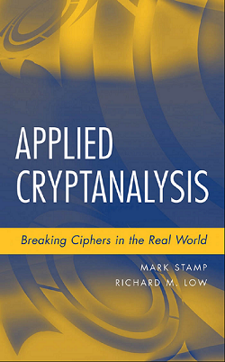
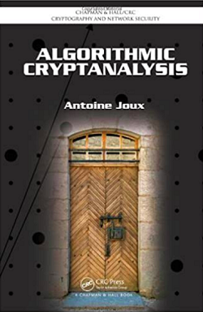
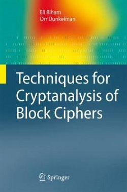
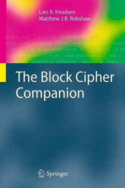
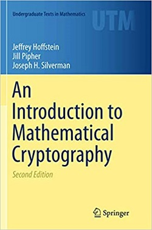
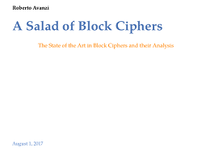
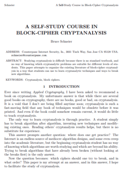

# Cryptanalysis

## Learn about cryptographic attacks and how to apply this knowledge to design secure cryptographic primitives.

I (Hosein Hadipour) originally created this repository in 2021. 
It was then forked and used by a Chinese teacher. 
However, anyone else can fork and use it if they find it useful. Any comments or modifications would be greatly appreciated.

## Goals and Contents

This course aims to give you in-depth knowledge about the cryptographic attacks, focusing on cryptanalysis of symmetric ciphers and asymmetric ciphers. More precisely, this course covers the following topics:

* Introduction to Cryptanalysis
  * Kerckhoffs' principle
  * Notions of security: confidentiality, integrity, authenticity and more
  * Models of attack
  * Targets of attack
  * Theoretical attacks vs. practical attacks
  * Lessons learned from classic ciphers
* Cryptanalysis of block ciphers
  * Meet-in-the-Middle attack & TMTO
  * Basic differential analysis
  * Basic linear analysis
  * Wide-trail strategy and AES
  * More (optional)
    * Integral cryptanalysis
    * Truncated differential attack
    * Higher order differential attack
    * Boomerang and rectangle attacks
    * Impossible differential attack
    * Multi dimensional linear attack
    * Zero-correlation linear attack
    * Division property
    * Demirci-Selcuk MitM attack
    * Subspace trail cryptanalysis
* Cryptanalysis of stream ciphers
  * Guess-and-determine attack on stream ciphers
  * Time-Memory-Data trade off attack
  * Linear distinguisher and correlation attacks
* Cryptanalysis of hash functions
  * Birthday attacks
  * MD and Sponge
  * Differential cryptanalysis and collision attacks
  * Meet-in-the-Middle Pre-image attack
* Computer-aided cryptanalysis
  * MILP-based cryptanalysis
  * SAT-based cryptanalysis
* Algebraic cryptanalysis
  * Interpolation attack
  * Cube attacks and Higher order differential attack
  * Linearization
* Merkle-Hellman Knapsack
* Diffie-Hellman Key Exchange and MitM
* Discrete Log algorithms
  * Baby-step giant-step
* Factoring algorithms  
  * Dixon’s Algorithm
  * Quadratic Sieve
* Quantum algorithms

## Material

### Slides

* [Session 2 (MitM and TMTO)](Slides/Main/第二节MitM_TMTO.pptx)
* [Session 3 (DC and LC)](Slides/Main/第三节_FEAL_DC_LC.pptx)
* [Session 4 (AES Wide Trail Strategy)](Slides/Main/第四节_AES_wide_trail.pptx)
* [Session 5 (Tools for Cryptanalysis)](Slides/Main/第五节-Tools%20for%20cryptanalysis.pdf)
* [Session 6 (Hash Functions)](Slides/Main/第六节_HashFunctions.pdf)
* [Session 7 (MD4 and Collision Attacks)](Slides/Main/第七节-MD4-collisionAttack.pptx)
* [Session 8 (Permutation Based Cryptography)](Slides/Main/第8节_permutation-based_crypto.pdf)
* [Session 9 (Boolean Functions)](Slides/Main/BF.pdf)
* [Session 10 (Cryptanalysis of Keccack)](Slides/Main/第10节_Cryptanalysis_of_Keccak.pdf)
* [Session 14 (Introduction to NTRU Public Key Cryptosystem)](Slides/Main/第14节-NTRU.pdf)
* [Session 15 (RSA and Coppersmith Method)](Slides/Main/第15节_RSA.pdf)

### Exercises

* Exercises after each section
  * [Homework 1](Exercises/Exercise1/Exercise1.pdf)

### Suggested Topics for Projects (choose one)

* Search for the best differential trails with MILP/SAT
* Search for the integral distinguishers based on division property using MILP/SAT
* Search for the cube attacks on stream ciphers with MILP/SAT
* Search for cubes for [Keccak](https://keccak.team/)
* Find parameters for the guess-and-determine attacks with MILP
* Implement Wiener's attack on [RSA](https://en.wikipedia.org/wiki/RSA_(cryptosystem))

### Suggested Topics for Seminars (choose one)

* Designs of stream ciphers with small states
* RSA and Shor's algorithm
* Differential analysis of keyless permutations
* Search for differential trails with MILP/SAT for pSP
* Machine learning-based symmetric cryptanalysis
* Hybrid approaches including:
  * Differential-Linear Attack
  * Algebraic-Differential Attack

### Textbooks

#### Applied Cryptanalysis: Breaking Ciphers in the Real World

[Website](http://www.cs.sjsu.edu/~stamp/crypto/)

#### Algorithmic Cryptanalysis

#### Techniques for Cryptanalysis of Block Ciphers

[Website](https://www.springer.com/gp/book/9783642172311)

#### The Block Cipher Companion

[Website](http://www2.mat.dtu.dk/people/Lars.R.Knudsen/bcc/)

#### An Introduction to Mathematical Cryptography

#### A Salad of Block Ciphers

[Download book](./Books/a_salad_of_block_ciphers.pdf)

It is available on Cryptology ePrint Archive:

[https://eprint.iacr.org/2016/1171](https://eprint.iacr.org/2016/1171)

#### A Self-Study Course in Block-Cipher Cryptanalysis

Studying cryptanalysis is difficult because there is no standard textbook, and no way of knowing which cryptanalytic problems are suitable for different levels of students. This paper attempts to organize the existing literature of block-cipher cryptanalysis in a way that students can use to learn cryptanalytic techniques and ways to break new algorithms.

[Download book](./Books/paper_self_study.pdf)

It is publicly available via the following link:

[https://www.schneier.com/wp-content/uploads/2016/02/paper-self-study.pdf](https://www.schneier.com/wp-content/uploads/2016/02/paper-self-study.pdf)
