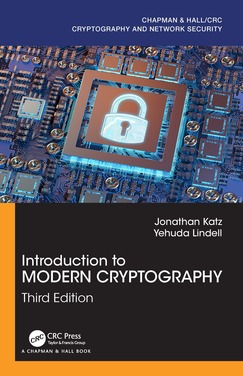

# Cryptanalysis

## Learn about cryptographic attacks and how to apply this knowledge to design secure cryptographic primitives.

I (Hosein Hadipour) created this repository for a cryptanalysis course in 2021. 
Anyone who finds this repository useful is welcome to use it. 
Any comments or modifications would be greatly appreciated.

## Goals and Contents

This course aims to provide you with in-depth knowledge of cryptographic attacks, focusing on the cryptanalysis of symmetric and asymmetric ciphers. 
More precisely, this course covers the following topics:

* Introduction to Cryptanalysis
  * Kerckhoffs' principle
  * Notions of security: confidentiality, integrity, authenticity and more
  * Models of attack
  * Targets of attack
  * Theoretical attacks vs. practical attacks
  * Lessons learned from classic ciphers
* Cryptanalysis of block ciphers
  * Meet-in-the-Middle attack & TMTO
  * Basic differential analysis
  * Basic linear analysis
  * Wide-trail strategy and AES
  * More (optional)
    * Integral cryptanalysis
    * Truncated differential attack
    * Higher order differential attack
    * Boomerang and rectangle attacks
    * Impossible differential attack
    * Multi dimensional linear attack
    * Zero-correlation linear attack
    * Division property
    * Demirci-Selcuk MitM attack
    * Subspace trail cryptanalysis
* Cryptanalysis of stream ciphers
  * Guess-and-determine attack on stream ciphers
  * Time-Memory-Data trade off attack
  * Linear distinguisher and correlation attacks
* Cryptanalysis of hash functions
  * Birthday attacks
  * MD and Sponge
  * Differential cryptanalysis and collision attacks
  * Meet-in-the-Middle Pre-image attack
* Computer-aided cryptanalysis
  * MILP-based cryptanalysis
  * SAT-based cryptanalysis
* Algebraic cryptanalysis
  * Interpolation attack
  * Cube attacks and Higher order differential attack
  * Linearization
* Merkle-Hellman Knapsack
* Diffie-Hellman Key Exchange and MitM
* Discrete Log algorithms
  * Baby-step giant-step
* Factoring algorithms  
  * Dixon’s Algorithm
  * Quadratic Sieve
* Quantum algorithms
* [Basic Lattice Cryptography](https://eprint.iacr.org/2024/1287)

## Material

### Slides

* [Session 1 (Boolean Functions)](Slides/Main/BF.pdf)
* [Session 2 (MitM and TMTO)](Slides/Main/MitM_TMTO.pptx)
* [Session 3 (DC and LC)](Slides/Main/FEAL_DC_LC.pptx)
* [Session 4 (AES Wide Trail Strategy)](Slides/Main/AES_wide_trail.pptx)
* [Session 5 (Tools for Cryptanalysis)](Slides/Main/L7_Tools_for_Cryptanalysis.pdf)
* [Session 6 (Algebraic Cryptanalysis)](Slides/Main/algebraic_attacks.pdf)
* [Session 7 (Hash Functions)](Slides/Main/L9_Hashfunction_Cryptanalysis.pdf)
* [Session 8 (MD4 and Collision Attacks)](Slides/Main/MD4-collisionAttack.pptx)
* [Session 9 (Permutation Based Cryptography)](Slides/Main/permutation-based_crypto.pdf)
* [Session 10 (Cryptanalysis of Keccack)](Slides/Main/Cryptanalysis_of_Keccak.pdf)
* [Session 11 (Introduction to NTRU Public Key Cryptosystem)](Slides/Main/NTRU.pdf)
* [Session 12 (RSA and Coppersmith Method)](Slides/Main/RSA.pdf)

### Exercises

* Exercises after each section
  * [Homework 1](Exercises/Exercise1/Exercise1.pdf)

### Suggested Topics for Projects (choose one)

* [Search for the best differential distinguishers/attacks with CP/MILP/SMT/SAT solvers](https://github.com/hadipourh/sboxanalyzer) 
* [Search for the best linear distinguishers/attacks with CP/MILP/SMT/SAT solvers](https://github.com/hadipourh/sboxanalyzer)
* [Search for the best integral distinguishers based on monomial prediction with CP/MILP/SMT/SAT solvers](https://eprint.iacr.org/2022/729)
* [Search for boomerang and rectangle distinguishers/attacks with CP/MILP/SMT/SAT solvers](https://eprint.iacr.org/2022/745)
* [Search for differential-linear distinguishers/attacks with CP/MILP/SMT/SAT solvers](https://eprint.iacr.org/2024/255)
* [Search for impossible-differential distinguishers/attacks with CP/MILP/SMT/SAT solvers](https://eprint.iacr.org/2023/1701)
* [Search for zero-correlation distinguishers/attacks with CP/MILP/SMT/SAT solvers](https://eprint.iacr.org/2022/1147)
* [Search for the guess-and-determine attacks using CP/MILP/SMT/SAT solvers](https://eprint.iacr.org/2021/1529)
* [Algebaric cryptanalysis using Groebner basis](https://github.com/hadipourh/CTC2-Fast-Algebraic-Attack)
* [Search for the guess-and-determine attacks using Groebner basis](https://github.com/hadipourh/autoguess)
* Search for the cube attacks on stream ciphers with CP/MILP/SMT/SAT solvers
* Search for cubes for [Keccak](https://keccak.team/)
* Find collision attacks on reduced versions of  [SHA-2](https://en.wikipedia.org/wiki/SHA-2) using signed differential characteristics
* Find preimage attacks on reduced versions of [SHA-3](https://en.wikipedia.org/wiki/SHA-3) using highly biased differential-linear distinguishers
* Implement Wiener's attack on [RSA](https://en.wikipedia.org/wiki/RSA_(cryptosystem))

### Suggested Topics for Seminars (choose one)

* Design of block ciphers with low-latency
* Design of block ciphers with a small block size
* Design of stream ciphers with small states
* RSA and Shor's algorithm
* Differential analysis of keyless permutations
* Search for differential/linear trails with CP/MILP/SMT/SAT solvers for SPN ciphers
* Search for differential/linear trails with CP/MILP/SMT/SAT solvers for ARX ciphers
* Machine learning-based symmetric cryptanalysis
* Hybrid approaches including:
  * Differential-Linear Attack
  * Boomerang Attack
  * Algebraic-Differential Attack

### Textbooks

Writing a book in the field of cryptanalysis is a challenging task, as this field is constantly evolving. However, there are some books that explain the basics of cryptanalysis and provide a good starting point for beginners. The best way to learn cryptanalysis is by reading scientific papers and attempting to implement the attacks yourself.

Before starting to read the following books, it is recommended to have a good understanding of cryptography and mathematics, including basic probability theory, discrete mathematics, combinatorics, number theory, abstract algebra, and linear algebra.

#### Introduction to Modern Cryptography

[**Website**](https://www.cs.umd.edu/~jkatz/imc.html)

#### Applied Cryptanalysis: Breaking Ciphers in the Real World

[**Website**](http://www.cs.sjsu.edu/~stamp/crypto/)

#### Algorithmic Cryptanalysis

#### Techniques for Cryptanalysis of Block Ciphers

[**Website**](https://www.springer.com/gp/book/9783642172311)

#### The Block Cipher Companion

[**Website**](http://www2.mat.dtu.dk/people/Lars.R.Knudsen/bcc/)

#### An Introduction to Mathematical Cryptography

#### Cryptography: Theory and Practice

[**Website**](https://cs.uwaterloo.ca/~dstinson/CTAP4.html)

#### Understanding Cryptography

[**Website**](https://www.crypto-textbook.com/)

#### A Salad of Block Ciphers

[Download book](./Books/a_salad_of_block_ciphers.pdf)

It is available on Cryptology ePrint Archive:

[https://eprint.iacr.org/2016/1171](https://eprint.iacr.org/2016/1171)

#### A Self-Study Course in Block-Cipher Cryptanalysis

Studying cryptanalysis is difficult because there is no standard textbook, and no way of knowing which cryptanalytic problems are suitable for different levels of students. This paper attempts to organize the existing literature of block-cipher cryptanalysis in a way that students can use to learn cryptanalytic techniques and ways to break new algorithms.

[Download book](./Books/paper_self_study.pdf)

It is publicly available via the following link:

[https://www.schneier.com/wp-content/uploads/2016/02/paper-self-study.pdf](https://www.schneier.com/wp-content/uploads/2016/02/paper-self-study.pdf)
